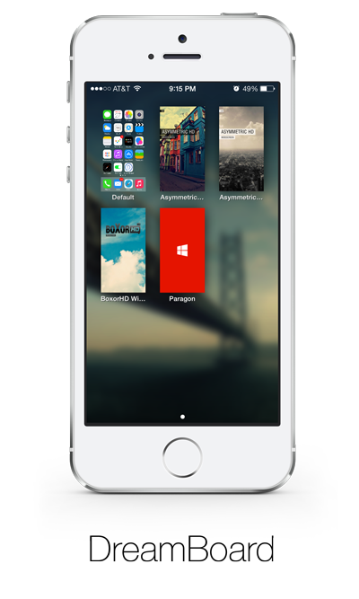
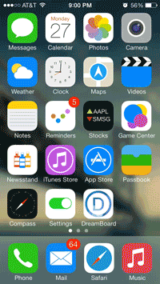

Dreamboard is a powerful iOS theming platform

Features
----------
- Uses objc-runtime to hook onto system methods and extend functionality
- Loads themes from XML layout files
- Custom script parser for interaction
- No setup necessary. Easily switch between themes without any hassle
- Interactive widgets, dyanmic layouts



Building
----------
Requires Xcode and Xcode Command Line Tools.

```sh
git clone 'https://github.com/wyndwarrior/DreamBoard.git'
cd DreamBoard
git submodule update --init --recursive
make
```

License
--------

Copyright 2014 Yu Xuan Liu. All rights reserved. Content licensed under the [GNU General Public License v3.0](LICENSE)
